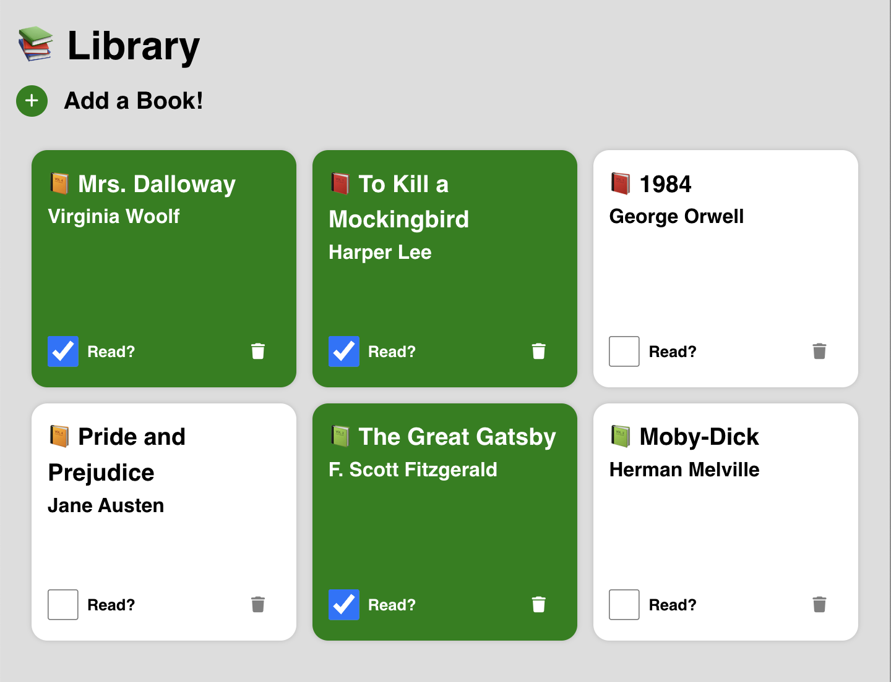

# Library App

This is a simple JavaScript app for managing a personal library. Users can add books, mark them as read or unread, and remove books from the library.



## Features

- Add new books to the library by entering a title and author.
- Mark books as read/unread with a checkbox.
- Delete books from the library.

## How to Use

Visit the live site here: https://carisaelam-library-app.netlify.app/

OR

1. Clone the repository to your local machine.

   ```bash
   git clone https://github.com/carisaelam/odin-library-app.git
   ```

2. Open `index.html` in a browser.

3. Use the "Add Book" button to reveal a form where you can add a new book by entering its title and author.

4. Once added, the book will appear as a card in the library display. You can:
   - Mark the book as read/unread using the checkbox.
   - Delete the book using the trash button.

## Code Structure

- **`Book` class**: Represents a book object with `title`, `author`, and `read` status.
- **`Library` class**: Manages the collection of books and handles user interactions.
  - **Event Listeners**: Set up for adding books, toggling the read status, and deleting books.
  - **Display Method**: Dynamically generates book cards and updates the DOM.
- **HTML Template**: Used to create book cards that show the title, author, and read status.
- **Seed Data**: Pre-populated with classic books for testing the application.

## Technologies Used

- JavaScript
- HTML/CSS
- Font Awesome (for icons)

## Future Enhancements

- Implement local storage to persist the library data between sessions.
- Add input validation to ensure valid book entries.
- Allow sorting and filtering of books.
